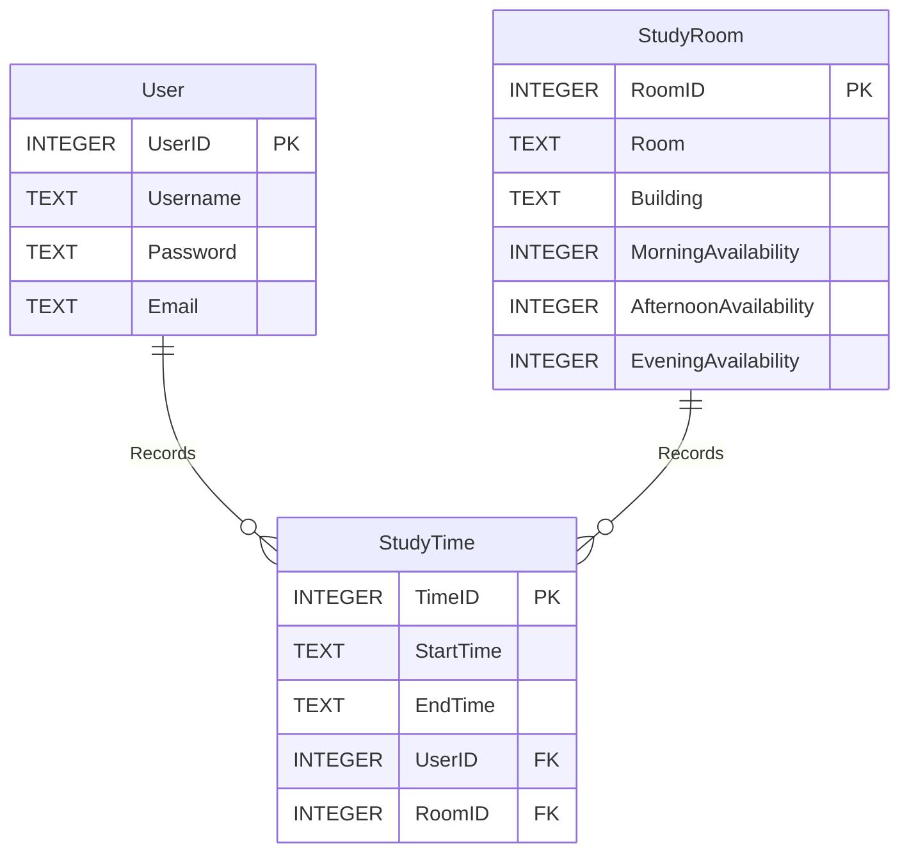

# StudySpace

## Database

### ER



### Create Tables

```sqlite
-- User Table
CREATE TABLE User (
    UserID INTEGER PRIMARY KEY,
    Username TEXT NOT NULL,
    Email TEXT NOT NULL UNIQUE,
    Password TEXT NOT NULL,
);

-- StudyRoom Table
CREATE TABLE StudyRoom (
    RoomID INTEGER PRIMARY KEY,
    Room INTEGER NOT NULL,
    Building INTEGER NOT NULL,
    MorningAvailability INTEGER, -- 0 for unavailable, 1 for available
    AfternoonAvailability INTEGER,
    EveningAvailability INTEGER
);

-- StudyTime Table
CREATE TABLE StudyTime (
    TimeID INTEGER PRIMARY KEY,
    UserID INTEGER,
    RoomID INTEGER,
    StartTime TEXT,
    EndTime TEXT,
    FOREIGN KEY (UserID) REFERENCES User (UserID),
    FOREIGN KEY (RoomID) REFERENCES StudyRoom (RoomID)
);

```

