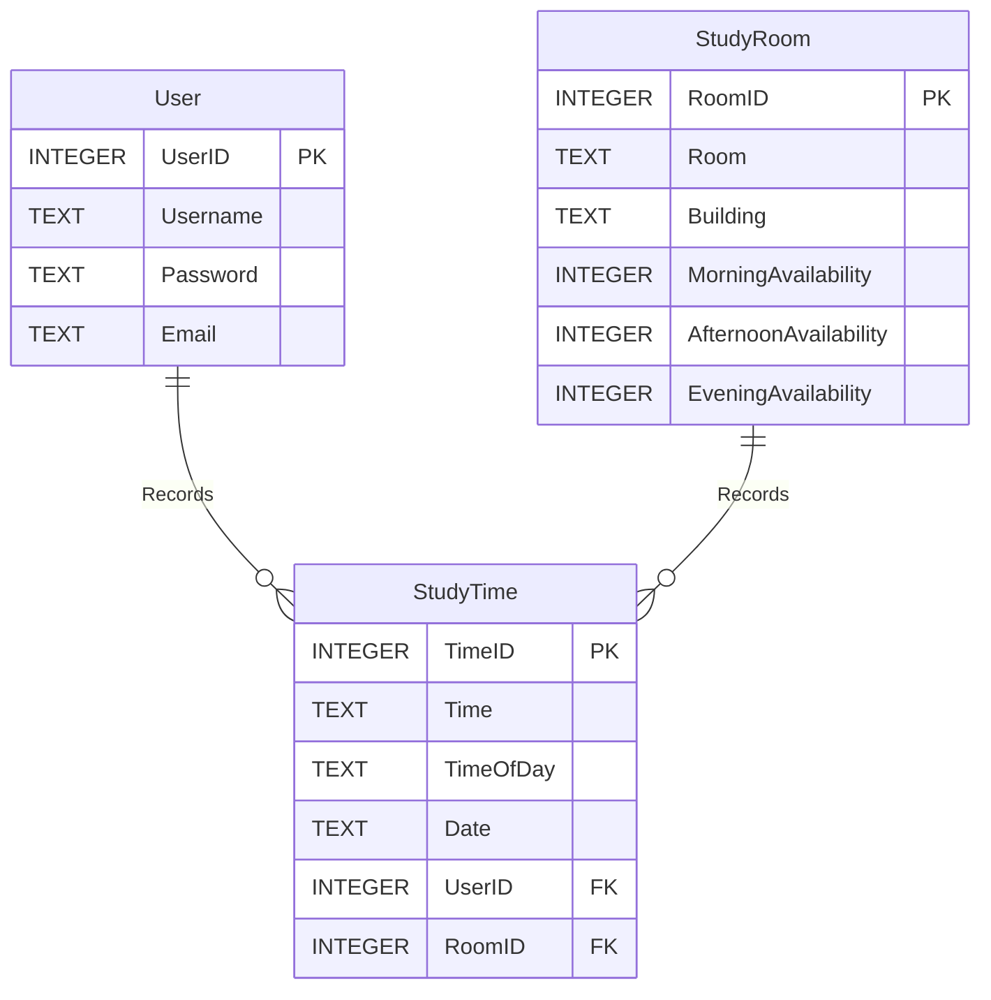

# StudySpace Application

## Documentation

### Outline

The [outline](./doc/Project_Outline.pdf) is in the `doc` folder as a pdf file.

### Alpha milestone

The [Alpha milestone report](./doc/Project_Alpha_submission.pdf) is in the `doc` folder as a pdf file. Click [here](https://youtu.be/0Scy31VG_Yc) to watch the Alpha milestone video.

### Beta milestone

The [Beta milestone report](./doc/Project_Beta_submission.pdf) is in the `doc` folder as a pdf file. Click [here](https://youtu.be/p8YCdtdoTZA) to watch the Beta milestone video.

## Database

### ER

