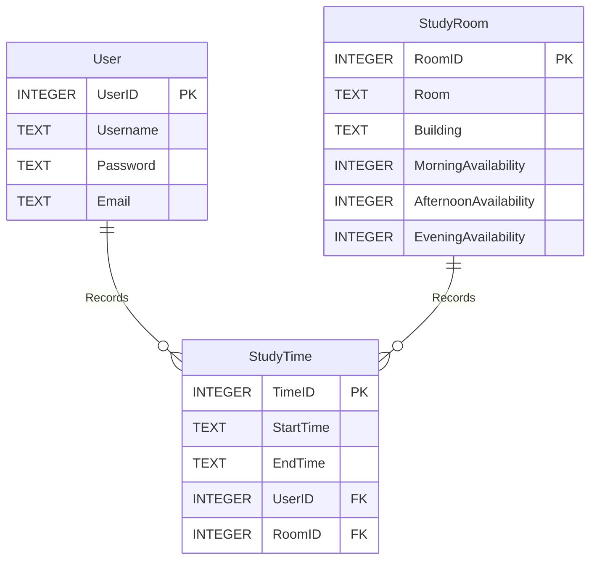

# StudySpace

## Database

### ER

```mermaid
erDiagram
    User ||--o{ StudyTime : Records
    StudyRoom ||--o{ StudyTime: Records
    

User {
    INTEGER UserID PK
    TEXT Username
    TEXT Password
    TEXT Email
}

StudyRoom {
     INTEGER RoomID PK
     TEXT Room
     TEXT Building
     INTEGER MorningAvailability 
     INTEGER AfternoonAvailability 
     INTEGER EveningAvailability 
}

StudyTime {
    INTEGER TimeID PK
    TEXT StartTime
    TEXT EndTime
    INTEGER UserID FK
    INTEGER RoomID FK
}
```

