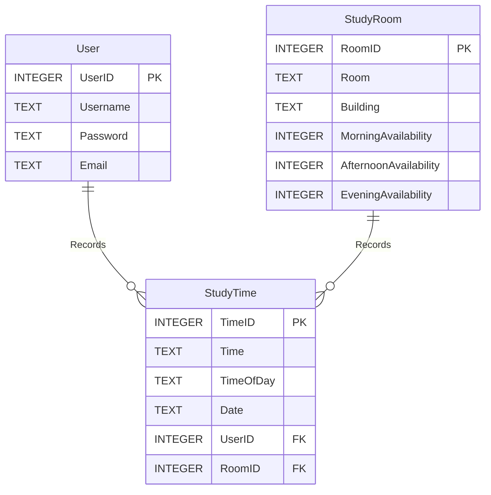

# StudySpace Application

## Documentation

- [outline](./Project_Outline.pdf)
- [Alpha milestone report](./Project_Alpha_submission.pdf) 
- Click [here](https://youtu.be/0Scy31VG_Yc) to watch the Alpha milestone video.
- [Beta milestone report](./Project_Beta_submission.pdf)
- Click [here](https://youtu.be/p8YCdtdoTZA) to watch the Beta milestone video.

## Database

### ER

